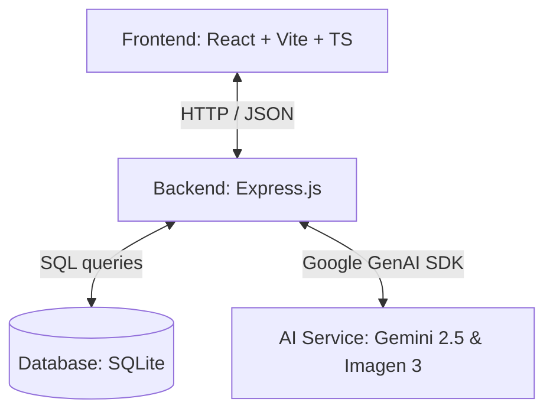
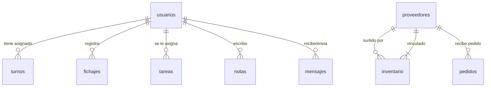

# Guía Técnica del ERP Salguacate (`agents.md`)

Bienvenido al repositorio de **Salguacate ERP**, un sistema integrado de gestión comercial para locales de hostelería diseñado para su funcionamiento óptimo en dispositivos móviles y tabletas. 

Este documento sirve como la **única fuente de verdad** de la arquitectura técnica, base de datos y flujos de integración del proyecto. Su propósito es guiar de manera exhaustiva a futuros desarrolladores y agentes de Inteligencia Artificial para que comprendan y extiendan el sistema de manera coherente sin romper la lógica de negocio ni la consistencia visual existente.

---

## 1. Propósito e Historia del Proyecto

El ERP Salguacate fue concebido para simplificar y digitalizar el día a día de un negocio de restauración con **dos establecimientos físicos**:
- **Local Principal**: El local principal de operaciones.
- **Segundo Local**: El nuevo local de expansión comercial.

El sistema está dividido en dos roles de acceso y perfiles de uso muy claros:
1. **Administración (`owner` y `manager`)**: Acceso a la gestión global de inventario, stock crítico, albaranes, agenda de eventos musicales y pinchadas, gestión de proveedores, contabilidad (cierres de caja diarios y gastos), checklists de tareas para el personal y analíticas visuales dinámicas.
2. **Plantilla (`employee`)**: Acceso simplificado a fichajes (reloj de entrada/salida y descansos), su calendario de turnos asignados (cuadrante), buzón interno de correspondencia y envío de peticiones (vacaciones, bajas o asuntos propios).

Adicionalmente, el ERP incorpora una **fuerte capa de Inteligencia Artificial** basada en los modelos de **Google Gemini** para automatizar el control de almacén visual, el registro de facturas, la creación interactiva de turnos y agendas por chat y la autogeneración de carteles artísticos de eventos.

---

## 2. Arquitectura de Software y Stack Técnico

El proyecto adopta una arquitectura monolítica desacoplada de tipo **SPA (Single Page Application) + API REST**:



### Frontend (Cliente SPA)
- **Framework**: React 18, empaquetado y servido con **Vite**.
- **Lenguaje**: TypeScript (`strict` mode activo en compilación).
- **Estilos**: TailwindCSS para un diseño responsivo enfocado en mobile-first.
- **Iconografía**: `lucide-react` para iconos interactivos.
- **Librería de Gráficos**: `recharts` para dashboards interactivos y analíticas de caja.
- **Generación de PDFs**: `window.print()` con hojas de estilo CSS optimizadas para impresión (nativa, sin dependencias pesadas).
- **Rutas**: `react-router-dom` para el enrutamiento del lado del cliente.
- **Control de Estado y Sesión**: `AuthContext` en memoria (el estado de login se destruye al refrescar la página por motivos de seguridad en terminales compartidas, forzando el PIN del empleado).

### Backend (Servidor API)
- **Entorno**: Node.js con el framework **Express**.
- **Base de Datos (Dual)**: 
  - Producción/Cloud: Integración nativa con **Turso (libSQL)** distribuido en la nube, usando las variables de entorno `TURSO_DATABASE_URL` y `TURSO_AUTH_TOKEN`.
  - Desarrollo/Local: Respaldo (fallback) automático a SQLite3 nativo en archivo (`server/database.sqlite`) si las credenciales de Turso no están presentes.
- **SDK de IA**: `@google/genai` (SDK profesional y oficial de Google) que se comunica directamente con la API Key contenida en `server/.env`.
- **Almacenamiento de archivos**: Sistema de archivos local (`server/uploads/`) para guardar imágenes de productos e imágenes analizadas por visión artificial.
- **Despliegue en la Nube**: El backend está configurado para despliegue automatizado y gratuito en **Render** mediante el archivo declarativo `render.yaml`.

### Aplicación Nativa Móvil (Android)
- El ERP cuenta con un envoltorio nativo (wrapper) en el directorio `/android`.
- La aplicación de Android carga el frontend React (SPA) optimizado a través de un componente `WebView` programado en `MainActivity.kt` con aceleración por hardware y pantalla completa inmersiva.
- **Compilación de assets**: El script `npm run build:android` automatiza el empaquetado y transferencia del código del frontend web a los assets locales de la aplicación nativa.

---

## 3. Estructura del Repositorio

El árbol de directorios de Salguacate ERP se organiza de la siguiente manera:

```
d:/00_Proyectos/SALGUACATE/
├── package.json              # Dependencias de frontend
├── tsconfig.json             # Ajustes de TypeScript
├── vite.config.ts            # Configuración de Vite
├── tailwind.config.js        # Configuración de estilos Tailwind
├── index.html                # Entrada HTML principal de la SPA
├── agents.md                 # Este documento de arquitectura (guía de desarrollo)
├── src/                      # Código fuente del Frontend
│   ├── main.tsx              # Punto de entrada de React (monta AuthProvider y App)
│   ├── App.tsx               # Enrutamiento de páginas, BottomNav por rol y Layout global
│   ├── index.css             # Estilos CSS globales y variables de Tailwind
│   ├── components/
│   │   └── AIChatbot.tsx     # Ventana de chat overlay con el asistente AI ("Salguabot")
│   ├── context/
│   │   └── AuthContext.tsx   # Contexto global de sesión contra el endpoint /api/login
│   └── pages/                # Vistas principales del ERP
│       ├── Login.tsx         # Pantalla táctil de acceso rápido por selección de usuario + PIN
│       ├── Dashboard.tsx     # KPIs dinámicos, alertas de stock, y accesos para owner/manager
│       ├── Inventory.tsx     # Catálogo de stock, alertas y modal para añadir productos
│       ├── Sales.tsx         # Gestión de cierres de caja diarios (Efectivo/Tarjeta/Descuadres)
│       ├── Providers.tsx     # Directorio telefónico y de datos de proveedores
│       ├── Scanner.tsx       # Escáner de PDFs e Inteligencia Artificial de visión (facturas/almacén)
│       ├── ManagerCalendar.tsx # Gestión de eventos de ocio e integración con Imagen 3 para carteles
│       ├── Tasks.tsx         # Gestión y asignación de checklists diarios para el personal por local
│       ├── StockControl.tsx  # Flujo de revisión manual, pedidos a proveedores y envíos a WhatsApp
│       ├── Notes.tsx         # Notas rápidas con dictado de voz nativo por navegador
│       ├── Reports.tsx       # Generación de informes financieros mensuales para exportación en PDF
│       ├── Analytics.tsx     # Gráficas de ventas, gastos, beneficio neto y descuadres de caja
│       ├── Settings.tsx      # Configuración de perfil y visualización de datos del usuario
│       └── employee/         # Páginas exclusivas para personal (camareros/cocineros)
│           ├── EmployeeDashboard.tsx # Turno del día, checklist de tareas asignadas
│           ├── Calendar.tsx  # Vista mensual simplificada de turnos programados
│           ├── Clock.tsx     # Interfaz interactiva de fichaje (entrada, descanso, salida)
│           ├── Messages.tsx  # Bandeja de entrada de comunicaciones internas de la empresa
│           └── Requests.tsx  # Formulario de peticiones de vacaciones, cambios y bajas médicas
└── server/                   # Backend del ERP (Express)
    ├── package.json          # Dependencias de backend
    ├── .env                  # GEMINI_API_KEY (clave secreta de la API de Google)
    ├── database.sqlite       # Archivo de la Base de Datos SQLite
    ├── database.js           # Esquema e inicialización de tablas SQLite
    ├── index.js              # API REST del servidor y lógica de Gemini (SDK GenAI)
    ├── server.log            # Historial de logs profesionales de operaciones
    └── uploads/              # Almacén de fotos de inventario y facturas
```

---

## 4. Esquema de Base de Datos (SQLite)

La base de datos SQLite se almacena físicamente en `server/database.sqlite`. Su esquema y relaciones son gestionados en `server/database.js`.



### Detalle de Tablas

#### 1. `usuarios`
Almacena la información de la plantilla.
- `id` (INTEGER, PRIMARY KEY AUTOINCREMENT): Identificador único.
- `nombre` (TEXT NOT NULL): Nombre y apellidos.
- `rol` (TEXT NOT NULL): Rol en el ERP (`owner`, `manager`, `employee`).
- `local` (TEXT): Local asignado habitual (`Principal`, `Segundo Local`, `Todos`).
- `telefono` (TEXT): Teléfono de contacto.
- `pin` (TEXT DEFAULT '0000'): Código PIN numérico de acceso rápido.

#### 2. `fichajes`
Historial de control horario de la plantilla.
- `id` (INTEGER, PRIMARY KEY AUTOINCREMENT)
- `usuario_id` (INTEGER, FOREIGN KEY -> `usuarios.id`)
- `entrada` (TEXT NOT NULL): Fecha y hora ISO de entrada.
- `salida` (TEXT): Fecha y hora ISO de salida (puede ser NULL si está trabajando).
- `estado` (TEXT DEFAULT 'trabajando'): Estado del turno (`trabajando`, `descanso`, `fuera`).

#### 3. `inventario`
Catálogo de productos de stock crítico de los locales.
- `id` (INTEGER, PRIMARY KEY AUTOINCREMENT)
- `producto` (TEXT NOT NULL): Nombre del artículo (ej. "Refresco de Cola 33cl").
- `stock_actual` (INTEGER DEFAULT 0): Unidades físicas en estantería.
- `stock_minimo` (INTEGER DEFAULT 5): Umbral de alerta para reposición.
- `local` (TEXT): Local físico del artículo (`Principal` o `Segundo Local`).
- `categoria` (TEXT DEFAULT 'Bebida'): Categoría del producto (`Bebida` o `Comida`).
- `imagen_url` (TEXT): URL relativa de la imagen local (`/uploads/item_...jpg`).
- `proveedor_id` (INTEGER, FOREIGN KEY -> `proveedores.id`): Proveedor asociado.

#### 4. `proveedores`
Directorio de proveedores para el aprovisionamiento.
- `id` (INTEGER, PRIMARY KEY AUTOINCREMENT)
- `nombre` (TEXT NOT NULL): Razón social / Nombre de contacto.
- `telefono` (TEXT): Teléfono de contacto (importante para el envío por WhatsApp).
- `email` (TEXT): Correo electrónico del proveedor.
- `categoria` (TEXT): Tipo de productos que surte (ej. "Alimentación", "Bebidas").

#### 5. `turnos`
Cuadrante de turnos programados.
- `id` (INTEGER, PRIMARY KEY AUTOINCREMENT)
- `usuario_id` (INTEGER, FOREIGN KEY -> `usuarios.id`)
- `fecha` (TEXT NOT NULL): Fecha del turno en formato `YYYY-MM-DD`.
- `hora_inicio` (TEXT NOT NULL): Hora de inicio `HH:MM`.
- `hora_fin` (TEXT NOT NULL): Hora de fin `HH:MM`.
- `local` (TEXT): Local del turno (`Principal` o `Segundo Local`).
- `compañeros` (TEXT): Nombres de los compañeros de turno (para visualización).

#### 6. `mensajes`
Buzón interno de correspondencia.
- `id` (INTEGER, PRIMARY KEY AUTOINCREMENT)
- `remitente_id` (INTEGER, FOREIGN KEY -> `usuarios.id`)
- `destinatario_id` (INTEGER, FOREIGN KEY -> `usuarios.id`)
- `asunto` (TEXT NOT NULL): Título del correo.
- `cuerpo` (TEXT NOT NULL): Contenido del mensaje.
- `fecha` (DATETIME DEFAULT CURRENT_TIMESTAMP)
- `leido` (BOOLEAN DEFAULT 0)

#### 7. `eventos`
Agenda del local (reuniones, reservas, conciertos, etc.).
- `id` (INTEGER, PRIMARY KEY AUTOINCREMENT)
- `titulo` (TEXT NOT NULL): Título del evento (ej. "Concierto Acústico").
- `fecha` (TEXT NOT NULL): Formato `YYYY-MM-DD`.
- `hora` (TEXT NOT NULL): Formato `HH:MM`.
- `descripcion` (TEXT): Comentarios del evento.
- `tipo` (TEXT DEFAULT 'General'): Tipo de evento (`General`, `Mantenimiento`, `Proveedor`, `Reunion`, `Pinchada`, `Concierto`).
- `creado_en` (DATETIME DEFAULT CURRENT_TIMESTAMP)

#### 8. `notas`
Notas rápidas de los administradores con persistencia.
- `id` (INTEGER, PRIMARY KEY AUTOINCREMENT)
- `usuario_id` (INTEGER, FOREIGN KEY -> `usuarios.id`)
- `contenido` (TEXT NOT NULL)
- `color` (TEXT DEFAULT 'yellow'): Color visual (`yellow`, `blue`, `green`, `pink`, `purple`).
- `fijada` (BOOLEAN DEFAULT 0): Si se pinea arriba del muro de notas.
- `creado_en` (DATETIME DEFAULT CURRENT_TIMESTAMP)

#### 9. `cierres`
Contabilidad diaria de ventas por local.
- `id` (INTEGER, PRIMARY KEY AUTOINCREMENT)
- `fecha` (TEXT NOT NULL): Fecha de la jornada fiscal `YYYY-MM-DD`.
- `local` (TEXT NOT NULL): Local del cierre (`Principal` o `Segundo Local`).
- `efectivo` (REAL DEFAULT 0): Arqueo físico de caja en efectivo.
- `tarjeta` (REAL DEFAULT 0): Suma de cobros de terminales POS.
- `invitaciones` (REAL DEFAULT 0): Valor en euros de consumiciones invitadas.
- `descuadre` (REAL DEFAULT 0): Diferencia sobre la caja teórica.
- `total` (REAL DEFAULT 0): Suma total de ingresos (`efectivo` + `tarjeta`).
- `creado_en` (DATETIME DEFAULT CURRENT_TIMESTAMP)

#### 10. `gastos`
Contabilidad de compras y facturas de proveedores.
- `id` (INTEGER, PRIMARY KEY AUTOINCREMENT)
- `fecha` (TEXT NOT NULL): Fecha del ticket/factura `YYYY-MM-DD`.
- `proveedor_nombre` (TEXT NOT NULL): Proveedor emisor.
- `total` (REAL DEFAULT 0): Importe total de la compra.
- `concepto` (TEXT): Descripción o resumen del albarán.
- `local` (TEXT DEFAULT 'Principal'): Local imputado al gasto (`Principal` o `Segundo Local`).
- `creado_en` (DATETIME DEFAULT CURRENT_TIMESTAMP)

#### 11. `tareas`
Checklist diario de operaciones para los empleados.
- `id` (INTEGER, PRIMARY KEY AUTOINCREMENT)
- `titulo` (TEXT NOT NULL): Acción a realizar (ej. "Limpiar cafetera").
- `descripcion` (TEXT): Instrucciones.
- `asignado_a` (INTEGER, FOREIGN KEY -> `usuarios.id`): Empleado responsable (si es null, es grupal).
- `fecha` (TEXT NOT NULL): `YYYY-MM-DD` para la que está planificada.
- `prioridad` (TEXT DEFAULT 'normal'): `baja`, `normal` o `alta`.
- `completada` (BOOLEAN DEFAULT 0): Estado de ejecución de la tarea.
- `local` (TEXT): Local de ejecución (`Principal`, `Segundo Local` o Ambos).
- `creado_en` (DATETIME DEFAULT CURRENT_TIMESTAMP)

#### 12. `pedidos`
Registro histórico de pedidos de stock.
- `id` (INTEGER, PRIMARY KEY AUTOINCREMENT)
- `fecha` (TEXT NOT NULL): `YYYY-MM-DD`.
- `local` (TEXT NOT NULL): Local que realiza el pedido.
- `proveedor_id` (INTEGER, FOREIGN KEY -> `proveedores.id`): Proveedor.
- `proveedor_nombre` (TEXT): Nombre para redundancia.
- `productos` (TEXT): Contenido en formato string JSON (ej. `[{"nombre":"Cerveza 33cl", "cantidad": 10}]`).
- `estado` (TEXT DEFAULT 'pendiente'): `pendiente` o `recibido`.
- `creado_en` (DATETIME DEFAULT CURRENT_TIMESTAMP)

---

## 5. Catálogo de la API REST

Todos los endpoints están expuestos bajo el puerto base `http://localhost:3001`. El payload y el intercambio se realizan exclusivamente en formato JSON.

### Endpoints de Usuarios / Autenticación
- **`GET /api/usuarios`**: Obtiene la plantilla completa (incluye PINs de seguridad; uso restringido a owners/managers).
- **`GET /api/usuarios/public`**: Obtiene lista simplificada de empleados (ID, nombre, rol) para la pantalla táctil de selección de Login.
- **`POST /api/login`**:
  - Payload: `{ usuario_id: INTEGER, pin: STRING }`
  - Retorna: `{ success: true, user: { id, nombre, rol, local } }` o error 401 si el PIN es incorrecto.
- **`POST /api/usuarios`**: Registra un empleado. Payload: `{ nombre, rol, local, telefono, pin }`
- **`PUT /api/usuarios/:id`**: Edita un empleado. Payload: `{ nombre, rol, local, telefono, pin }`
- **`DELETE /api/usuarios/:id`**: Elimina un empleado de la BD.

### Endpoints de Inventario y Control de Stock
- **`GET /api/inventario?local=STRING`**: Obtiene el catálogo del local especificado (opcional). Realiza un `LEFT JOIN` para incluir el nombre del proveedor.
- **`POST /api/inventario`**: Registra un artículo. Soporta `imagen_base64` en el payload, guardando la imagen como un archivo JPG físico en `/uploads/` de manera automática y guardando la ruta relativa en la base de datos.
- **`PUT /api/inventario/:id/stock`**:
  - Payload: `{ increment: INTEGER }` (positivo para sumar, negativo para restar).
  - Retorna confirmación tras ejecutar la suma salvaguardando que no sea menor a 0 (`max(0, stock_actual + ?)`).
- **`GET /api/inventario/alertas?local=STRING`**: Obtiene los artículos donde `stock_actual < stock_minimo`.

### Endpoints de Fichajes y Turnos
- **`POST /api/fichar`**:
  - Payload: `{ usuario_id: INTEGER, tipo: 'entrada' | 'salida' }`
  - Registra marcas de entrada e introduce el registro en la tabla `fichajes` o actualiza la marca de salida y marca el estado como `fuera`.
- **`GET /api/turnos?usuario_id=INTEGER`**: Lista los turnos programados en el calendario (opcionalmente filtrado por empleado).
- **`POST /api/turnos`**: Registra un cuadrante. Payload: `{ usuario_id, fecha, hora_inicio, hora_fin, local, compañeros }`

### Endpoints de Notas y Mensajes
- **`GET /api/notas`**: Lista las notas en el muro, ordenadas por fijadas arriba primero, luego por fecha.
- **`POST /api/notas`**: Guarda una nota. Payload: `{ contenido, color, usuario_id }`
- **`PUT /api/notas/:id`**: Edita una nota. Payload: `{ contenido, color, fijada }`
- **`DELETE /api/notas/:id`**: Borra una nota física de la base de datos.
- **`GET /api/mensajes?usuario_id=INTEGER`**: Mensajes dirigidos al buzón del usuario logueado.
- **`POST /api/mensajes`**: Envía correspondencia interna. Payload: `{ remitente_id, destinatario_id, asunto, cuerpo }`

### Endpoints de Finanzas y Pedidos
- **`GET /api/cierres`**: Historial completo de ventas en orden descendente.
- **`POST /api/cierres`**: Registra el arqueo de caja (calcula el `total` sumando efectivo + tarjeta). Payload: `{ fecha, local, efectivo, tarjeta, invitaciones, descuadre }`
- **`GET /api/gastos`**: Historial de facturas y gastos.
- **`POST /api/gastos`**: Registra gastos del negocio. Payload: `{ fecha, proveedor_nombre, total, concepto }`
- **`GET /api/pedidos`**: Lista histórica de pedidos realizados.
- **`POST /api/pedidos`**: Registra un pedido realizado. Payload: `{ fecha, local, proveedor_id, proveedor_nombre, productos }` (donde productos es un array JSON de artículos pedidos).
- **`PATCH /api/pedidos/:id/recibido`**: Cambia el estado del pedido a 'recibido'.
- **`DELETE /api/pedidos/:id`**: Elimina el registro del pedido de la BD.

### Endpoints de Agenda y Eventos
- **`GET /api/eventos`**: Lista la agenda ordenada cronológicamente de forma ascendente.
- **`POST /api/eventos`**: Guarda un evento. Payload: `{ titulo, fecha, hora, descripcion, tipo }`
- **`PUT /api/eventos/:id`**: Edita un evento. Payload: `{ titulo, fecha, hora, descripcion, tipo }`
- **`DELETE /api/eventos/:id`**: Borra un evento de la agenda.

---

## 6. Integración y Automatización con Inteligencia Artificial (Google GenAI)

Salguacate ERP incorpora una robusta capa de inteligencia artificial utilizando el SDK oficial `@google/genai` conectado a los modelos de última generación de Google.

### A. Visión Computacional (Gemini 2.5 Flash)
Expuesto en el endpoint **`POST /api/ai/vision`**. Recibe una imagen en Base64 y un parámetro `mode` (`invoice` o `inventory`):
1. **Modo `invoice` (Análisis de facturas/albaranes)**:
   - Envía la foto a `gemini-2.5-flash` con instrucciones para extraer la información fiscal de compras de hostelería.
   - Retorna un JSON estructurado con el nombre del `proveedor` de hostelería, el importe `total` numérico y un texto resumen `rawText`.
   - En el frontend, el módulo `Scanner.tsx` permite al usuario revisar el total extraído y registrarlo en contabilidad con un solo clic (llamando a `POST /api/gastos`).
2. **Modo `inventory` (Recuento visual de estanterías y almacenes)**:
   - Envía la foto del almacén a `gemini-2.5-flash`.
   - Estima de manera automática el número de botellas físicas que se visualizan en la imagen (`botellasEstimadas`), con un porcentaje de seguridad en el conteo (`confianza`) y una breve explicación (`rawText`).

### B. Chatbot de Gestión Contextual y "Function Calling" (Gemini 2.5 Flash)
Expuesto en el endpoint **`POST /api/ai/chat`**. Es un asistente interactivo ("Salguabot") integrado en un chat overlay flotante (`AIChatbot.tsx`).
- **Contexto en tiempo real**: En cada mensaje, el backend inyecta dinámicamente en el prompt del sistema el estado completo en tiempo real de la plantilla (`usuarios`) y el inventario del bar (`inventario`).
- **Llamada a Funciones (Function Calling)**: El modelo está equipado con herramientas para interactuar con la base de datos de manera autónoma si el usuario realiza comandos de lenguaje natural. Las funciones registradas son:
  - `crear_evento`: Crea eventos en la agenda.
  - `borrar_evento`: Elimina eventos mediante su ID.
  - `modificar_stock`: Suma o resta botellas del inventario.
  - `asignar_turno`: Programa cuadrantes para el personal.
- **Flujo de Ejecución**:
  ```
  Mensaje de Usuario -> Gemini -> Petición de Función -> Ejecución SQL local -> Gemini (Resumen Natural) -> Frontend
  ```
  Cuando la función se ejecuta con éxito, el backend responde con un flag `actionExecuted: true`. El frontend capta este flag y emite un evento global de JavaScript (`window.dispatchEvent(new Event('ai_action_executed'))`). Todas las páginas escuchan este evento y refrescan sus datos automáticamente para dar una experiencia de uso fluida.

### C. Generador de Carteles Promocionales (Imagen 3)
Expuesto en el endpoint **`POST /api/ai/poster`**. Utiliza el modelo de generación de imágenes de vanguardia **`imagen-3.0-generate-002`**.
- Está integrado en el calendario de eventos (`ManagerCalendar.tsx`) exclusivamente para eventos de tipo musical (`Pinchada` o `Concierto`).
- Envía un prompt altamente específico al modelo que incluye el nombre del evento, la fecha, hora, tipo de evento y el nombre del bar "Salguacate", especificando un estilo moderno, neón y de gran contraste.
- Devuelve la imagen generada en Base64, que el manager puede visualizar y descargar como archivo PNG local en formato vertical ideal para publicar en redes sociales como Instagram Stories.

---

## 7. Convenciones Críticas de Codificación y Diseño UI/UX

Para conservar la excelente cohesión visual y el comportamiento del ERP, se deben respetar de manera obligatoria las siguientes pautas en futuras modificaciones:

### Consistencia de Locales
- Los locales **SIEMPRE** deben llamarse `"Principal"` y `"Segundo Local"`. No utilices cadenas alternativas como "Terraza", "Local Principal", "Local 2", etc., en la persistencia de datos (inventario, tareas, cierres) para evitar roturas en los filtros.
- En la interfaz, los filtros de locales deben representarse siempre de forma unificada utilizando botones de tipo "pills" independientes con el icono `<MapPin size={12} />` de Lucide React y las mismas clases de TailwindCSS para uniformidad visual (ej. fondo blanco/slate en modo oscuro, con la pill seleccionada en color verde o de marca).

### Seguridad y Sesión
- El `AuthContext` gestiona la sesión en memoria. Al refrescar, la aplicación volverá al estado de login. Esto está hecho de manera intencionada para prevenir que se queden sesiones administrativas abiertas en dispositivos compartidos de hostelería. No introduzcas almacenamiento localStorage permanente de las credenciales de rol a menos que el usuario lo solicite explícitamente.

### Diseño y Estilos
- El diseño debe mantenerse **ultra-premium** y limpio, utilizando las clases gradientes de marca (`from-brand-600 to-brand-800`), esquinas redondeadas generosas (`rounded-2xl` o `rounded-3xl`), sombras suaves, y soporte impecable para **Modo Oscuro** en absolutamente todos los componentes mediante la clase `dark:` de TailwindCSS.
- No añadas placeholders estáticos sin lógica. Si agregas botones o tarjetas visuales nuevas, conéctalas con sus respectivos endpoints o con el Router de React.

---

## 8. Comandos de Arranque y Configuración de Desarrollo

### Requisitos Previos
- Node.js instalado (versión 18 o superior).
- Un archivo `.env` en la carpeta `server/` con la clave correspondiente:
  ```env
  GEMINI_API_KEY=AIzaSy... (Tu API Key de Google AI Studio)
  ```

### Puesta en Marcha

1. **Iniciar el Backend (API & Base de Datos)**:
   ```powershell
   cd server
   npm install
   npm start
   ```
   *Nota: Si es la primera vez que se ejecuta y no se ha configurado Turso, el script database.js creará la base de datos local database.sqlite e insertará automáticamente los datos de prueba (4 usuarios iniciales, turnos y mensajes).*

2. **Iniciar el Frontend (React + Vite)**:
   Abra una nueva pestaña de terminal en la raíz del proyecto y ejecute:
   ```powershell
   npm install
   npm run dev
   ```
   La aplicación web se servirá de forma local en: `http://localhost:5173`.

3. **Compilar y Generar Aplicación Nativa (Android)**:
   Si desea desplegar la aplicación móvil en TPVs o Tablets del restaurante:
   ```powershell
   npm run build:android
   ```
   Esto compilará el código de React en modo de producción y lo copiará de forma automática a la carpeta `android/app/src/main/assets/www/`. Una vez copiado, abra la carpeta `android` utilizando Android Studio y genere el paquete compilado (APK) mediante *Build > Build APK(s)*.

### Usuarios y PINs Iniciales de Prueba
Para pruebas rápidas de los flujos del ERP, se pueden utilizar las siguientes credenciales en la pantalla táctil de login:
- **Jefe Admin** (Propietario): PIN `0000` (Acceso global administrativo).
- **Encargado Principal** (Manager): PIN `0000` (Acceso de encargado asignado a Local Principal).
- **María García** (Empleado): PIN `0000` (Acceso simplificado de camarero/empleado).
- **Juan Pérez** (Empleado): PIN `0000`.

---
*Este documento es una guía viva de arquitectura. Si realizas cambios que modifiquen el esquema de la base de datos o añadan APIs clave, asegúrate de mantener este archivo actualizado.*
